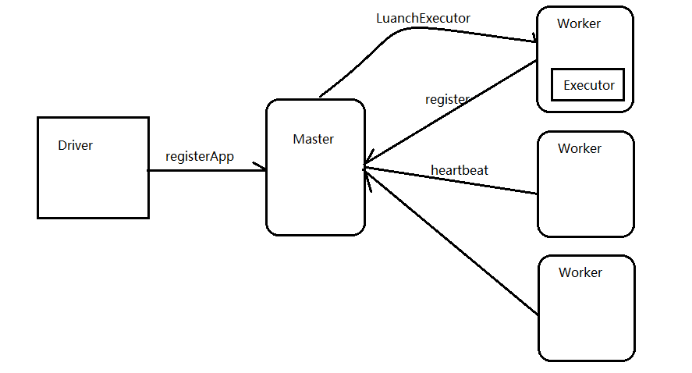
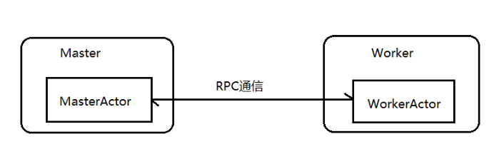

# akka
使用Akka实现一个简易版的spark通信框架

Spark 的RPC是通过Akka类库实现的，Akka用Scala语言开发，基于Actor并发模型实现，Akka具有高可靠、高性能、可扩展等特点，使用Akka可以轻松实现分布式RPC功能。

##### 架构图:

##### 重要类介绍:

**ActorSystem：**在Akka中，ActorSystem是一个重量级的结构，他需要分配多个线程，所以在实际应用中，ActorSystem通常是一个单例对象，我们可以使用这个ActorSystem创建很多Actor。

**注意：**

1. ActorSystem是一个进程中的老大，它负责创建和监督actor
2. ActorSystem是一个单例对象
3. actor负责通信

##### Actor:

在Akka中，Actor负责通信，在Actor中有一些重要的生命周期方法。

1. preStart()方法：该方法在Actor对象构造方法执行后执行，整个Actor生命周期中仅执行一次。
2. receive()方法：该方法在Actor的preStart方法执行完成后执行，用于接收消息，会被反复执行。